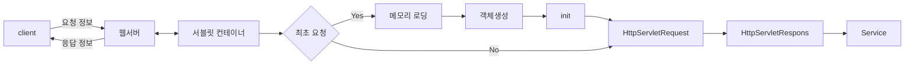

실제 애플리케이션의 루트 디렉터리는 "WebContent" 이다.

-> url의 /에서 접근

웹 애플리케이션 루트 디렉터리 바로 하위에 WEB-INF 디렉터리와 WEB-INF[^1] 디렉터리에는 web.xml 파일이 있어야 한다.


***

Java SE 프로그램은 개발자가 main() 메소드 안에 구현한 순서대로 실행된다. 즉, 프로그램이 실행되는 순서를 개발자가 제어한다.

그러나 Java EE 기반 프로그램은 실행의 흐름을 컨테이너가 제어한다.

이처럼 개발자가 아닌 제 3자가 프로그램의 실행 흐름을 제어하는 것을 IoC(Inversion of Control), "제어의 역전"이라고 한다.


서블릿 실행순서


1. 클라이언트로부터 처리 요청받음: 요청받은 페이지가 서블릿이면 서블릿 컨테이너에 처리를 넘기고, 서블릿 컨테이너는 요청받은 서블릿을 WEB-INF/classes나 WEB-INF/lib에서 찾아서 실행 준비를 한다.
2. 최초의 요청 여부 판단: 서블릿 컨테이너는 현재 실행할 서블릿이 최초의 요청인지 판단하고 실행할 서블릿 객체가 메모리에 없으면 최초 요청이고, 이미 있으면 최초의 요청이 아닌 것으로 판단한다.
3. 서블릿 객체 생성: 서블릿 컨테이너는 요청받은 서블릿이 최초의 요청이라면 해당 서블릿을 메모리에 로딩하고 객체를 생성한다. 일반 자바 객체는 new명령문으로 여러 개의 객체를 언제든지 직접 생성할 수 있지만, 서블릿은 최초 요청이 들어왔을 때 한 번만 객체를 생성하고 이때 생성된 객체를 계속 사용한다.
4. init() 메소드 실행: 주로 객체의 초기화 작업이 구현되어 있다.
5. service() 메소드 실행: 실행하는 서블릿의 요청 순서에 상관없이 클라이언트의 요청이 있을 때마다 실행된다. 따라서 service() 메소드에서는 실제 서블릿에서 처리해야하는 내용이 구현되어 있다.


```java
package com.edu.test;

import java.io.IOException;

import javax.servlet.ServletConfig;
import javax.servlet.ServletException;
import javax.servlet.ServletRequest;
import javax.servlet.ServletResponse;
import javax.servlet.http.HttpServlet;

public class FirstServlet extends HttpServlet{
	@Override
	public void init(ServletConfig config) throws ServletException {
		System.out.println("init() 실행됨!");
	}
	@Override
	public void service(ServletRequest arg0, ServletResponse arg1) throws ServletException, IOException {
		System.out.println("service() 실행됨!");
	}
}
```

***

콜백메소드(callback method): 어떤 객체에서 어떤 상황이 발생하면 컨테이너가 자동으로 호출하여 실행하는 메소드

> init(), service(), destroy() 등

이러한 콜백메소드들이 서블릿을 실행한다.

***

url: http://localhost:8080/edu/portalSite

`@WebServlet`: 클라이언트가 서블릿을 접근하기 위한 경로 지정

```java
package com.edu.test;

import java.io.*;
import javax.servlet.*;
import javax.servlet.annotation.WebServlet;
import javax.servlet.http.*;

// 서블릿 실행을 위한 uri를 "\potalSite"로 변경
@WebServlet("/portalSite")
public class SendRedirectTestServlet extends HttpServlet {

	public void doGet(HttpServletRequest req, HttpServletResponse resp) throws ServletException, IOException {

		String param = "naver";
		if (param.equals("naver")) {
			resp.sendRedirect("http://www.naver.com");
		} else if (param.equals("daum")) {
			resp.sendRedirect("http://www.daum.net");
		} else if (param.equals("zum")) {
			resp.sendRedirect("http://zum.com");
		} else if (param.equals("google")) {
			resp.sendRedirect("http://www.google.com");
		}
	}
}
```

***


[^1]: 환경설정 파일