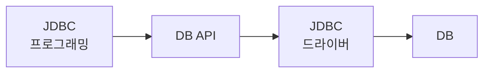

## JSP(JavaServer Pages)

### JSP란?
JSP (JavaServer Pages)는 HTML, DHTML, XHTML, XML과 같은 동적 웹 콘텐츠를 생성하는 애플리케이션을 만들기 위한 J2EE 플랫폼에 속하는 자바 기술입니다. JSP 기술은 동적 콘텐츠를 만들어내는 웹페이지를 쉽고 강력하면서도 유연하게 작성할 수 있도록 해줍니다.

***

### JSP 개념

동적인 콘텐츠를 만들 때는 어떠한 형태로든 "콘텐츠를 어떻게 생성할지"를 지시하는 프로그래밍이 필요합니다. 그런데 서블릿처럼 프로그램 소스 안에 HTTML, 태그를 처리하면, 변경이 일어날 때마다 매번 컴파일해줘야 해서 동적인 콘텐츠를 만들기 어렵습니다. JSP 기술은 동적으로 콘텐츠를 생성하기 위해 프로그래밍 코드가 담긴 스크립트를 포함할 수 있게 하고, HTML과 유사한 태그를 통해 어려운 자바 코딩 없이도 자바 객체를 사용할 수 있게 합니다.
JSP는 1998년 첫 번째 API가 발표되었고 1999년 6월 1.0. 1.1, 1.2 스펙에 이어, 2017년 03월 현재 JSP 2.3으로 J2EE1.7 스펙에 포함되어 있습니다. 이 스펙들은 서블릿과 JSP를 지원하는 웹서버나 웹 애플리케이션 서버에 의해 구현되고 있으며, 이미 구현된 JSTL(Java Standard Tag Library)과 같은 태그 라이브러리도 있고, 동적 데이터 표현을 위한 간단한 EL(Expression Language) 같은 기술들이 개 발 환경을 더욱 풍성하게 해주고 있습니다. 이들은 웹 서비스에서 최전방을 담당하는 기술들로서 웹 서비스 구현에 밑거름이 되고 있습니다.


JSP 기술은 다음과 같은 개념을 기반으로 만들어졌습니다.
#### 템플릿 데이터

대부분 동적 웹 콘텐츠를 이루는 많은 부분은 고정되어 있거나 템플릿(Termplate) 데이터입니다. 템플릿 데이터는 전형적으로 텍스트나 XML, 조각, HTML 태그들일 수 있습니다. JSP 기술은 이러한 템플릿 데이터들이 변형되지 않도록 처리하는 방법을 지원합니다.

```JSP
<HTML>
    <BODY>
        <H1>Hello World!</H1>
    </BODY>
</HTML>
```


JSP에서 이러한 템플릿 데이터 부분은 해석하지 않고 그대로 출력해줍니다. 서블릿은 HTML, 코드 부분을 `out.print("<HTML>”);`와 같이 출력해줘야 하지만, JSP는 프로그램적인 명령문들만 컨테이너가 해석해서 처리하고, HTML 태그 부분은 그대로 HTML로 처리되므로 별도의 명령문들로 처리할 필요가 없습니다.

#### 동적인 데이터의 추가

JSP 기술은 템플릿 데이터에 동적인 데이터를 끼워 넣을 수 있는 간단하지만 강력한 방법을 제공합니다.

```jsp
<HTML>
	<BODY>
        <H1>Hello World!</H1>
		<%= request.getParameter("name") %>
	</BODY>
</HTML>
```


위 코드는 name이라는 질의 문자열을 추출하여 출력하는 코드입니다. JSP에서 제공하는 내장 객체 request를 이용해서 쉽게 동적인 데이터를 추가할 수 있습니다. 이처럼 JSP에서는 템플릿 데이터와 함 께 출력을 쉽게 할 수 있는 '표현식(expression)'이라는 스크립팅 요소를 제공하고 있으며, JSP 2.0은 좀 더 확장된 기능으로 EL(Expression Language)이라는 것도 제공하고 있어서 동적인 콘텐츠를 쉽게 작업할 수 있습니다.

#### 기능의 추상화

추상화는 객체지향 프로그램에서 사용하는 용어로서 세부 구현은 숨기고 기능을 사용할 수 있도록 구현 하는 것을 의미하며, 재사용성을 높이는 기술입니다. ISP 기술은 이런 기능의 추상화를 위해 다음 두 가지 메커니즘을 제공합니다.

* 자바빈즈(JavaBeans) 컴포넌트 아키텍처: **컴포넌트라는 개념은 규격에 맞게 조각들을 만들어 놓고 조각들을 이용해 완성한 하나의 제품을 만들자**는 것인데요. 자바에서도 규격에 맞는 조각이 있는데 이것을 자바빈즈(JavaBeans)라고 하며, JSP에서 사용하는 컴포넌트는 JSP 자바빈즈라고 합니다. 자바빈즈를 이용하면 재사용성이 높은 웹 애플리케이션을 개발할 수 있습니다.

* 태그 라이브러리: 자주 사용하는 기능을 매번 구현하는 것이 아니라, JSP 태그로 만들어 사용한다면 한 번의 작성으로 여러 곳에서 사용할 수 있어 재사용성을 높일 수 있습니다.

  

이러한 일반적인 개념들을 기반으로 1.92 기술이 정의되어 있으며. 이러한 사항들에 대한 제상한 교회 웹 개발을 더 강력하고 쉽게 만들어 줄 수 있는 바탕이 될 수 있습니다.

***

### JSP 장점

* Write Once, Run Anywhere properties : 자바의 모토라고 할 수 있는 특징으로 JSP는 플랫폼에 무관하고, JSP 스펙을 지원하는 어떠한 웹 애플리케이션 서버에서도 동작합니다.

* 역할 분리: JSP는 프레젠테이션 기능과 비즈니스 로직 기능을 분리할 수 있어서 개발자와 디자이너의 역할을 분리할 수 있습니다. 

* 컴포넌트와 태그 라이브러리의 재사용: JSP는 자바빈즈 컴포넌트와 EJB, 태그 라이브러리에 기반을 두고 재사용성을 강조하고 있습니다. 이미 재사용할 수 있는 많은 태그 라이브러리가 있으며, 컴포넌트 기반의 페이지를 작성할 수 있는 방법을 제공합니다.
* 정적 콘텐츠와 동적 콘텐츠의 분리
* 액션, 표현식, 스크립팅 제공: 추상화한 표준태그
* N-tier 엔터프라이즈 애플리케이션을 위한 웹 접근 레이어: 여러 레이어로 구분 가능

***

### JSP 실행 순서


1. 클라이언트로부터 JSP요청이 들어오면, JSP 컨테이너는 태그로 만들어진 JSP 파일을 완벽한 자바 소스로 변환하여 *.java파일로 만듬
2. JSP컨테이너는 *.jsp파일을 변환한 *.java 파일을 컴파일하여 *.class 파일을 만듬
3. 컴파일된 자바 실행 파일은 서블릿 컨테이너에 의해 서블릿으러서 동작
4. 변환과 컴파일 작업은 최초의 요청이나 JSP가 변경되었을 때만 수행됨

**변환**: 컨테이너는 JSP를 해석하여 하나의 서블릿 소스로 만든 다음에 해당 소스를 컴파일한다. 그러면 서블릿 클래스 파일이 생성되는데, 이 서블릿 클래스는 JSP가 실행될 수 있는 형태로 구현된 JSP 구현 클래스이다.

**실행**: 컨테이너는 서블릿으로 변환되어 컴파일된 구현 서블릿 클래스를 초기화하고, 이 서블릿 클래스를 통해 요청을 처리하고 응답한다.

***

* 주석`<%-- --%>`

* 지시자`<%@ 지시자 속상 = 값 %>`: JSP 컨테이너가 JSP 페이지를 파싱하여 자바 소스로 변환하는 데 필요한 정보를 알려주기 위해 사용

```jsp
<%@  page  contentType="text/html; charset=UTF-8"  import="java.util.*"  %>
```

* errorPage와 isErrorPage 속성

```jsp
<%@ page contentType="text/html;charset=UTF-8"%>
<%@ page isErrorPage="true"%>
<html>
<head>
<title>예외상황 처리</title>
</head>
<body>
	<h4>다음과 같은 에러가 발생하였습니다.</h4>
	에러타입 :
	<%=exception.getClass().getName()%>
	<br> 에러메세지:
	<%=exception.getMessage()%>
</body>
</html>
```

아래의 jsp 실행 시 param이 빈값이면 오류가 발생하여 위의 페이지에서 오류처리함

```jsp
<%@ page contentType="text/html;charset=UTF-8"%>
<%@ page errorPage="example3.jsp"%>
<%
	String param = request.getParameter("id");
	if (param.equals("test"))
		param = " 파라미터가 입력되었습니다. (예외 상황이 발생하지 않았습니다.)";
%>
<html>
<body>
	<h4>
		<%=param%>
	</h4>
</body>
</html>
```

* trimDirectiveWhitespaces 첫째 줄 빈 줄 제거

```jsp
<%@ page contentType="text/html; charset=UTF-8"%>
<%@ page trimDirectiveWhitespaces="true" %>
```

* include

```jsp
<%@ include file="copyright.jsp" %>
```

* 스크립트릿`<% 실행문 %>`: 자바코드 추가

* 표현식`<%= 실행문 %>`: 변수 표현 (=`out.print(변수)`)

* 선언문`<%! 변수 선언 %>` `<%! 메소드 선언 %>` 

```jsp
<%@ page contentType="text/html; charset=UTF-8"%>
<html>
<head>
<title>덧셈</title>
</head>
<body>
	<h3>선언문으로 구현한 덧셈</h3>
	<%!
		public int sum(int a, int b){
		   return a+b;
    	}
	%>
	덧셈의 결과 : <%= this.sum(20,30) %> 
</body>
</html>
```

***

### 내장객체

: JSP 파일에서 자바 소스로 변환될 때 _jspService() 메소드에 자동으로 선언 및 초기화되는 객체들을 의미한다.

* `<% %>`, `<%= %>` 태그에서는 내장 객체를 바로 사용할 수 있다.

```java
	public void _jspService(final javax.servlet.http.HttpServletRequest request,
			final javax.servlet.http.HttpServletResponse response)
			throws java.io.IOException, javax.servlet.ServletException {

		/* 생략 */

		final javax.servlet.jsp.PageContext pageContext;
		javax.servlet.http.HttpSession session = null;
		final javax.servlet.ServletContext application;
		final javax.servlet.ServletConfig config;
		javax.servlet.jsp.JspWriter out = null;
		final java.lang.Object page = this;
		javax.servlet.jsp.JspWriter _jspx_out = null;
		javax.servlet.jsp.PageContext _jspx_page_context = null;

		try {
			response.setContentType("text/html");
			pageContext = _jspxFactory.getPageContext(this, request, response, null, true, 8192, true);
			_jspx_page_context = pageContext;
			application = pageContext.getServletContext();
			config = pageContext.getServletConfig();
			session = pageContext.getSession();
			out = pageContext.getOut();
			_jspx_out = out;
			/* 생략 */
	}
```

내장 객체 request의 타입은 HttpServletRequest이며 요청정보를 처리한다.

내장 객체 response의 타입은 HttpServletResponse이며 응답정보를 처리한다.

내장 객체 session의 타입은 HttpSession이며 클라리언트 단위로 처리되는 객체이다.

내장 객체 out의 타입은 JspWrite이며 클라이언트 쪽에 출력 처리 객체이다.

```jsp
<%@ page contentType="text/html;charset=UTF-8"%>
<html>
<head><title>Input</title></head>
<body>

<% if(session.isNew()||session.getAttribute("id")==null){ %>
   <%
       String msg = (String)request.getAttribute("error");
       if(msg==null)  msg ="";
   %>
   <%= msg %>

	<form action="example10.jsp" method="post">
		ID: <input type="text" name="id"><br> 
		비밀번호:<input type="password" name="pwd"><br> 
		
		<input type="submit" value="로그인">
	</form>
<%}else{ %>	
	<a href="example10.jsp">로그 아웃</a>
<%} %>	
</body>
</html>
```

```jsp
<%@ page contentType="text/html;charset=UTF-8" %>

<html>
<head><title>Result</title></head>
<body>

<%  if(request.getMethod().equals("POST")) {%>
	<%
	   String id = request.getParameter("id");
	   String pwd = request.getParameter("pwd");
	   // 유효성 체크 
	   if(id.isEmpty() || pwd.isEmpty()){
		   request.setAttribute("error", "ID 또는 비밀번호를 입력해주세요!");
		   RequestDispatcher rd = request.getRequestDispatcher("logInOut.jsp");
		   rd.forward(request,response);
		   return;
	   }
	   
	   //로그인 처리
	   if(session.isNew() || session.getAttribute("id") == null ){
		   session.setAttribute("id", id);
		   out.print("로그인 작업이 완료되었습니다.");
	   }else{
		   out.print("이미 로그인 상태입니다.");
	   }
	%>
	<%= id %> / <%= pwd %>

<% }else if(request.getMethod().equals("GET")){
	
	   if(session!=null&&session.getAttribute("id")!=null){
	      session.invalidate();
	      out.print("로그아웃 작업이 완료되었습니다.");
	   }else{
		   out.print("현재 로그인 상태가 아닙니다.");
	   }
	}
%>

<%
	RequestDispatcher rd = request.getRequestDispatcher("logInOut.jsp");
	rd.forward(request,response); // 로그인/로그아웃 작업 후 기존 화면으로 이동 처리
%>
</body>
</html>
```

`session.isNew()`: HttpSession 객체를 추출할 때 새로 생성해서 반환하면 true이고, 기존에 있던 HttpSession 객체를 반환하면 fasle이다.

`session!=null`: 현재 HttpSession 객체가 존재하는지 여부

`session.invalidate();`: HttpSession 객체 삭제


내장 객체 application의 타입은 ServletContext이며 웹 애플리케이션 단위로 처리되는 객체이다.

* ServletContext는 웹 애플리케이션마다 하나씩, 서비스가 시작될 때 생성되는 객체로서, 서버에 대한 정보 추출과 웹 애플리케이션 단위로 상태 정보를 유지하기 위해 사용한다.

```jsp
<%@ page contentType="text/html;charset=UTF-8" %>
<html>
<head>
<title>application</title>
</head>
<body>
서버명 : <%= application.getServerInfo() %><br>
서블릿 버젼 : <%= application.getMajorVersion()%>.<%= application.getMinorVersion() %><br>
<h3>/edu 리스트</h3>
<%
  java.util.Set<String> list = application.getResourcePaths("/");
  
  if(list != null){
	  Object[] obj = list.toArray();
	  for(int i=0;i<obj.length;i++){
		  out.print(obj[i]+"<br>");
	  }
			  
  }

%>
</body>
</html>
```


`java.util.Set<String> list = application.getResourcePaths("/");`: 인자로 지정한 디렉터리 목록을 반환한다.


내장 객체 pageContext의 타입은 PageContext이며 JSP 페이지마다 하나씩 생성된다.

PageContext는 JSP 내장 객체를 반환하는 메소드를 제공한다.

```jsp
<%@ page contentType="text/html;charset=UTF-8"%>
<html>
<head>
<title>pageContext</title>
</head>
<body>
	<%!public void work(String p, PageContext pc) {
		try {
			JspWriter out = pc.getOut();
			if (p.equals("include")) {
				out.print("-- include 전 -- <br>");
				pc.include("test.jsp");
				out.print("-- include 후 -- <br>");
			} else if (p.equals("forward")) {
				pc.forward("test.jsp");
			}
		} catch (Exception e) {
			System.out.println("오류 발생!!");
		}
	}%>
	<%
		String p = request.getParameter("p");
		this.work(p, pageContext);
	%>
</body>
</html>
```

```jsp
<!-- test.jsp -->
<h3>hello</h3>
```

`JspWriter out = pc.getOut();`: out 내장 객체는 _jspService() 메소드 내에서 선언된 지역 변수이므로 초기화에서 사용 시 PageContext 내장 객체를 이용해야한다.

> `<% ... %>`, `<%= ... %>`에서는 out 내장 객체 사용가능

p값이 include이면 `include`로 포함되며 , forwad이면 test.jsp로 `forward`(이동) 됨


***

### 표준 액션 태그와 JSP 자바빈즈

JSP의 XML 기반 태그는 표준 액션 태그와 커스텀 태그가 있다.

`<태그 라이브러리 이름 : 태그 이름>`

* 표준액션 태그 : JSP 컨테이너에서 기본으로 제공하는 태그
  * `<jsp:output>`

* 커스텀 태그: 개발자가 만들어 사용하는 태그
  * `<a:output>`


#### 표준액션태그

표준 액션 태그 라이브러리 이름은 jsp이다.

forward 표준 액션 태그는 다른 페이지로 이동시킨다.

```jsp
	<%
		String p = request.getParameter("p");
	%>
	<jsp:forward page="<%=p%>" />
```

include 표준 액션 태그는 다른 페이지를 현재 페이지에 포함한다.

```jsp
	<h3>-- include 전 --</h3>
	<jsp:include page="test.jsp" />
	<h3>-- include 후 --</h3>
```

#### JSP 자바빈즈

: JSP 표준 액션 태그로 접근할 수 있는 자바 클래스로서 값을 가지는 속성(멤버변수)과 값을 설정하는 메소드(setter), 값을 추출하는 메소드(getter)로 이루어져 있다.

* JSP Bean은 JSP 컨테이너에 의해 동작하는 자바 객체이다.

* JSP Bean은 패키지화해야 한다.

* JSP Bean 멤버변수의 접근자는 private으로 선언한다.

* JSP Bean은 기본 생성자를 가져야한다.

* JSP Bean은 private으로 선언된 멤버변수의 getter, setter 메소드를 선언해야한다.

```java
package com.edu.beans;

public class HelloBean {

	private String name;
	private String number;
	
	public HelloBean() {
		this.name = "이름이 없습니다.";
		this.number = "번호가 없습니다.";
	}

	public String getName() {
		return name;
	}

	public void setName(String name) {
		this.name = name;
	}

	public String getNumber() {
		return number;
	}

	public void setNumber(String number) {
		this.number = number;
	}
}
```

* useBean 표준 액션 태그는 JSP Bean 객체를 생성하거나 이미 생성된 객체를 추출한다.
  * `scope` : 4개 중 하나를 지정, 생략할 경우 page가 기본 적용
    * page: 하나의 JSP 페이지에서만 사용
    * request: 요청이 처리되는 동안 forward, include된 페이지 간에 사용
    * session: 클라이언트 단위로 사용
    * application: 웹 애플리케이션 단위로 사용
  * `id`
  * `class`

```java
HelloBean hello = new HelloBean();
=> <jsp:useBean class="com.edu.beans.HelloBean" id="hello" />
```

* getPropertty 표준 액션 태그는 JSP Bean의 getter 메소드를 호출한다.
  * `name`: `useBean` 태그에 정의 해 놓은 id속성값과 동일하게 지정, name속성으로 자바빈을 참조

  * `property`: 추출하려는 자바빈즈 객체의 멤버변수 이름을 지정


```java
hello.getName();
=> <jsp:getProperty property="name" name="hello" /><br>
```

* setPropertty 표준 액션 태그는 JSP Bean의 setter 메소드를 호출한다.
  * `name`: `useBean` 태그에 정의 해 놓은 id속성값과 동일하게 지정, name속성으로 자바빈을 참조
  * `property`: 수정하려는 자바빈즈 객체의 멤버변수 이름을 지정
    * `property=*`: 자바빈 객체의 모든 속성값을 질의 문자열에서 찾아서 지정
  * `value`: 변경하려는 값을 지정
  * `param`: 질의 문자열에서 param 속성에 할당된 값과 같은 name의 값으로 자바빈의 속성값을 설정
    * 설정값 생략할 경우 질의 문자열에서 `property`와 동일한 멤버변수를 가져감

```java
hello.setName("Amy");
=> <jsp:setProperty property="name" name="hello" value="Amy" />

hello.setName(request.getParameter("irum"));
=> <jsp:setProperty property="name" name="hello" param="irum" /> 
```

```jsp
<%@ page contentType="text/html;charset=UTF-8"%>
<html>
<head>
<title>Java Bean</title>
</head>
<body>
	<jsp:useBean class="com.edu.beans.HelloBean" id="hello" />

	<jsp:getProperty property="name" name="hello" /><br>
	<jsp:getProperty property="number" name="hello" /><br>

	<jsp:setProperty property="*" name="hello"/>

	<hr>

	<jsp:getProperty property="name" name="hello" /><br>
	<jsp:getProperty property="number" name="hello" /><br>

</body>
</html>
```


***

### 데이터 베이스

> DBMS(DataBase Management System)

* JDBC[^1] 프로그래밍은 DB 서버와 접속하여 SQL 문을 실행하는 프로그램이다.
* JDBC 프로그래밍 시 기본적으로 java.sql 패키지의 API들을 사용한다.
* JDBC Driver는 java.sql의 인터페이스들을 구현한 클래스 파일들이다.



1. DB API: DB 작업을 하기 위해 사용하는 java.sql 패키지로서 SE에서 제공
2. JDBC 드라이버: 실제 DB작업을 처리하는 파일로서 \WEB-INF/lib에 준비되어 있음
3. DBMS: DBMS는 오라클 11g EE로 설치를 완료함

> 컴파일 시 8080 에러 발생할 경우
>
> 1. netstat -ano | findstr 8080
> 2. taskkill /f /pid @@@@

#### JDBC 드라이버 로딩

Class.forName() 메소드는 JDBC Driver 파일을 사용할 수 있도록 준비해준다.

`Class.forName("oracle.jdbc.driver.OracleDriver");`

#### DBMS 서버 접속

DriverManager.getConnection()은 DB 서버와 접속한 후 Connection을 반환한다.

`static Connection getConnection(String url, String user, String password)`

* String url (jdbc:oracle:thin:@localhost:1521:xe)
  * jdbc:oracle:thin: -> 오라클 protocol
  * @localhost -> 서버주소
  * 1521 -> 서버포트
  * xe: DB이름
* String user: DB 서버에 로그인할 계정
* String password: DB 서버에 로그인할 비밀번호

Connection의 메소드를 사용하여 Statement와 PreparedStatement를 생성한다.

* Connection 객체가 길이라면 Statement 객체는 서로에세 데이터를 전달해주는 객체이다

#### Statement 객체

Statement와 PreparedStatement의 executeUpdate(), executeQuery() 메소드를 사용하여 SQL 문을 실행한다.

* executeQuery(): ResultSet[^2]을 반환, select 문 사용
* executeUpdate(): int를 반환, 나머지 명령문 사용

#### PreparedStatement 객체

: Statement 객체와 같은 기능을 수행하는 객체로서, 연결된 DB에 SQL 문을 실행한 후 결괏값을 가져오는 메소드를 가지고 있다. Statement와 다른 점은 PreparedStatement 객체는 생성 시 SQL문을 `?` 기호와 함께 작성할 수 있다.

#### close

* DB서버와의 작업이 완료된 후에는 모든 자원을 해제한다. 해제 시 close() 메소드를 사용한다.

```jsp
<%@ page language="java" contentType="text/html; charset=UTF-8"
    pageEncoding="UTF-8"%>
<%@ page import="java.sql.*" %>

<%
	// 1. JDBC Driver 로딩하기
	Class.forName("oracle.jdbc.driver.OracleDriver");
	// 2. DB 서버 접속하기
	String url = "jdbc:oracle:thin:@localhost:1521:xe";
	Connection conn = DriverManager.getConnection(url,"scott","tiger");
	// 3. Statement or PreparedStatement 객체 생성하기
	String id = request.getParameter("id");
	String pwd = request.getParameter("pwd");
	
	Statement stmt = conn.createStatement();
	stmt.executeUpdate("insert into test values ('"+id+",'"+pwd+"')");
	
	PreparedStatement pstmt = conn.prepareStatement("insert into test values(?,?)");
	pstmt.setString(1, id);
	pstmt.setString(2, pwd);
	pstmt.executeUpdate();
	// 4. SQL 실행하기
	stmt.executeUpdate("create table test(id varchar2(5), pwd varchar2(5))");
	// 5. 자원해제
	stmt.close();
	// 6. 연결해제
	conn.close();
%>
```


#### DataSource

##### Connection Pool

: Connection Pool은 Connection 객체를 프로그램이 실행될 때마다 생성하는 것이 아니라, 웹 애플리케이션이 서비스되기 전에 웹서버에서 미리 생성하여 준비한 다음, 필요할 때 준비된 Connection을 가져다 사용함으로써 JDBC 프로그래밍 문제점들을 개선한 기술이다.

* Connection Pool은 여러 개의 Connection을 갖는 서버 자원이다.

##### DataSource

* DataSource는 Connection Pool을 관리하는 목적을 사용되는 객체이다.
* JNDI Server를 통해서 이용된다.
* DataSource 객체를 통해서 Connection을 얻어오고 반납하는 등의 작업을 수행한다.

##### JNDI(Java Naming and Directory Interface)

: JNDI는 API와 SPI로 이루어져 있으며, API는 애플리케이션에서 네이밍 혹은 디렉터리 서비스에 접근하는 데 사용하며, SPI는 새로운 서비스를 개발할 때 사용된다.

> Naming and Directory 서비스는 흔히 DNS 서버의 기능과 같다.(도메인과 IP 주소만을 연결해주는 기능...)

* JNDI 서버는 분산환경에서 서버 자원을 접근할 수 있도록 해준다.

##### 이용방법

1. JNDI Server에서 lookup() 메소드를 통해 DataSource 객체를 획득한다.
2. DataSource 객체의 getConnection() 메소드를 통해서 Connection Pool에서 Free 상태의 Connection을 획득한다.
3. Connection 객체를 통한 DBMS 작업을 수행한다.
4. 모든 작업이 끝나면 DataSource 객체를 통해서 Connection Pool에 Connection을 반납한다.

##### 구현

1. server.xml 설정

```xml
  <GlobalNamingResources>
    <!-- Editable user database that can also be used by
         UserDatabaseRealm to authenticate users
    -->
    <Resource driverClassName="oracle.jdbc.driver.OracleDriver" 
    url="jdbc:oracle:thin:@127.0.0.1:1521:xe" 
    username="scott" 
    password="tiger" 
    name="jdbc/myoracle" 
    type = "javax.sql.DataSource"
    maxActive="4"
    maxIdel="2"
    maxWait="5000"
    />
  </GlobalNamingResources>
```

* driverClassName: DB 작업을 위해 로딩할 JDBC 드라이버 파일에 드라이버 인터페이스를 상속하는 파일명을 전체 이름 으로 지정합니다. Class forName( ) 메소드의 인자값입니다.
* url: 접속할 DB 서버의 URL을 지정합니다.
* username: DB 서버에 로그인할 계정을 지정합니다.
* password: DB 서버에 로그인할 계정의 비밀번호를 지정합니다.
* name: 현재 리소스를 등록할 이름을 지정합니다.
* type: 리소스의 타입을 지정합니다. Connection Pool을 사용할 수 있도록 해주는 객체의 타입은 javax. sql.DataSource 입 니다.
* maxActive: 생성할 Connection 수를 지정합니다.
* maxidle: 일반적으로 활용할 Connection 수를 지정합니다.
* maxWait: Connection의 사용 요청이 있을 때 대기 시간을 지정합니다. 5000은 5초를 의미하며, 5초가 지난 후에도 Conection을 얻지 못하면 Exception 발생합니다.

2. context.xml 설정내용 추가

```xml
<ResourceLink global="jdbc/myoracle" name="jdbc/myoracle" type="javax.sql.DataSource" />
```

3. web.xml 설정

```xml
	<resource-ref>
		<description>Oracle DataSource example</description>
		<res-ref-name>jdbc/myoracle</res-ref-name>
		<res-type>javax.sql.DataSource</res-type>
		<res-auth>Container</res-auth>
	</resource-ref>
```

* description: 리소스에 대한 설명을 지정
* res-ref-name: 사용하고자 하는 리소스의 이름을 지정
* res-type: 사용하고자 하는 리소스의 타입을 지정
* res-auth리소스에 대한 권한이 누구인지 지정

```jsp
<%@ page language="java" contentType="text/html; charset=UTF-8"
    pageEncoding="UTF-8"%>
<%@ page import="java.sql.*" %>
<%@ page import="javax.sql.*" %>
<%@ page import="javax.naming.*" %>

<%
	// 1.JDNI 서버 객체 생성
	InitialContext ic = new InitialContext();
	// 2. lookup()
	DataSource ds = (DataSource) ic.lookup("java:comp/env/jdbc/myoracle");
	// 3. getConnection()
	Connection conn = ds.getConnection();
	
	Statement stmt = conn.createStatement();
	ResultSet rs = stmt.executeQuery("select * from test");
	
	while(rs.next()){
		out.print("<br>"+rs.getString("id")+":"+rs.getString(2));
	}
	
	rs.close();
	stmt.close();
	conn.close();
%>
```


* `InitialContext ic = new InitialContext();`

: Connection Pool에 접근하려면 JNDI 서비스를 사용해야 합니다. JNDI는 서비에서 관리하고 있는 리소스에 대한 정보를 알고 있고 특정 리소스를 찾아서 사용할 수 있도록 객체를 반환해주는 역할을 합니다. JNDI 서버 역할을 하는 객체를 생성합니다. 리소스가 로컬에 있을 때는 단순히 InitialContext  객체만 생성하면 됩니다.

* `DataSource ds = (DataSource) ic.lookup("java:comp:env/jdbc/myoracle");`

`ic.lookup()`은 리소스를 찾은 후 리소스를 사용할 수 있도록 객체를 반환해주는 메소드입니다. lookup() 메소드의 인자값으로는 찾으려는 리소스의 등록된 이름을 지정합니다. 우리가 찾으려는 리소스의 이름은 `jdbc/myoracle`입니다. 그래서 `lookup("jdbc/myoracle")`으로 해야 하는데 `lookup("java: comp/env/jdbc/myoracle")`을 지정했습니다. 이것은 WAS로 톰켓을 이용하기 때문입니다. 톰캣에서는 리소스를 관리하는 가상의 디렉터리가 있는데. 경로가 `java:comp/env`입니다. 그래서 톰캣을 사용할 때는 리소스 이름 앞에 `java.comp/env`의 경로를 지정해 주어야 합니다.

lookup() 메소드가 반환하는 객체의 타입은 Object이기 때문에 원래 리소스 타입으로 타입 변환 작업을 해야 합니다. `(Datasource) ic.lookup("java: comp/env/jdbc/myoracle");`는 반환받은 값을 DataSource로 타입 변환을 하고 있습니다. DataSource 객체는 Connection Pool 리소스의 데이터 타입입니다.

* `Connection conn = ds.getConnection();`

ds 변수는 DataSource입니다. DataSource객체의 getConnection()는 Connection Pool에 준비 된 Connection 객체를 빌려오는 메소드입니다. 빌려온 Connection을 conn으로 받았습니다.

***

### EL(Expression Language)

EL은 서블릿 기능을 JSP보다 간단하게 표현할 수 있는 기술이다.

EL은 `${ }` 내에 표현식으로 표현한다.

논리, 숫자, 문자, 연산자, 변수를 사용하여 표현식을 작성한다.

EL은 산술, 논리, 비교, empty 연산자가 있다.

EL은 요청정보, scope에 관한 내장 객체를 지원한다.

EL은 scope에 저장된 데이터를 `${ 이름 }`으로 간단하게 추출할 수 있다.

```jsp
<%@ page contentType="text/html;charset=UTF-8"%>
<html>
<head>
<title>EL</title>
</head>
<body>
	${param.id }   / ${param.pwd }    <br>
	${param["id"]} / ${param["pwd"]}
    <jsp:forward page="${param.p}"></jsp:forward>
	<%
		Enumeration<String> list = request.getHeaderNames();
		while (list.hasMoreElements()) {
			String key = list.nextElement();
			out.print("<br>" + key + " : " + request.getHeader(key));
		}
	%>
<hr>
${header}
</body>
</html>
```

* `request.getHeaderNames()` 메소드는 요청정보의 헤더에서 헤더정보의 이름들만 추출하여 반환하는 메소드이다.

* `request.getHeader(key)` 메소드는 key 변수에 저장된 헤더의 이름에 매핑된 값을 추출한다.

```jsp
<%@ page contentType="text/html;charset=UTF-8" %>
<html>
<head>
<title>Book Input</title>
</head>
<body>
<form action="example22.jsp" method="post">
  책제목 : <input type="text" name="title"><br>
  책저자 : <input type="text" name="author"><br>
  출판사 : <input type="text" name="publisher"><br>
  <input type="submit" value="등록" >
</form>
</body>
</html>
```


```jsp
<%@ page contentType="text/html;charset=UTF-8"%>
<%@ page import ="com.edu.beans.BookBean" %>
<html>
<head>
<title>example</title>
</head>
<body>
	<jsp:useBean id="book" class="com.edu.beans.BookBean" />
	<jsp:setProperty property="*" name="book" />
	<%
		request.setAttribute("book", book);
		//session.setAttribute("book", book);
		//application.setAttribute("book", book);
	%>
	<jsp:forward page="bookOutput.jsp" />
</body>
</html>
```

* `request.setAttribute("book", book);` 는 아래와 같다.

```jsp
book.setTitle(request.geParameter("title"));
book.setAuthor(request.geParameter("author"));
book.setPublisher(request.geParameter("publisher"));
```

* request는 HttpServletRequest 내장 객체이므로 setAttribute를 통해 HttpServletRequest  객체에 book이란 이름을 변수 book의 값을 등록한다.

```jsp
<%@ page contentType="text/html;charset=UTF-8" %>
<html>
<head>
<title>Book Output</title>
</head>
<body>
	책제목 : ${book.title} <br> 
	책저자 : ${book.author} <br>
	출판사 : ${book.publisher}
</body>
</html>
```

* EL 구문으로 `${book}`처럼 표현하는 경우에는 request, session, application 객체 순서로 `getAttrinbute("book")` 메소드를 실행한다. requst 객체에서 먼저 `getAttrinbute("book")`을 실행하고 만약 request 객체에 book이 없을 경우 session 등의 순서로 실행한다.

***

### 커스텀태그

: 커스텀 태그는 개발자가 직접 만들어 사용하는 XML 기반 태그이다.

* UI에서 반복되는 내용을 한 번만 작성한 후 JSP 태그와 매핑한다.
* 커스텀 태그는 클래스 기반과 태그 기반 형태의 개발 방법이 있다.

#### 클래스 기반 커스텀 태그

: 태그의 기능을 자바 클래스 파일에 구현한 다음, JSP 태그와 연결해서 사용한다.

* 클래스 기반 커스텀 태그는 상속받는 객체에 따라 1.2과 2.1 버전이 있다.


**태그 핸들러 클래스(Tag Handler Class)**
커스팀 태그를 사용할 때 호출되는 자바 클래스 파일입니다. 커스팀 태그가 수행해야 하는 실행문을 구현하고 있는 자바 객체입니다.

**태그 라이브러리 디스크립터(Tag Library Descriptor=TLD)**

: TLD 파일은 태그 핸들러 클래스와 JSP 페이지에서 사용할 태그 이름을 매핑하여 커스텀 태그를 동작할 수 있게 하는 커스텀 태그 환성설정 파일이며 XML 형태이다.

* 커스텀 태그가 수행해야 하는 실행문은 태그 핸들러 클래스에 구현한다.
* JSP 페이지 내에서 사용할 때는 클래스를 직접 사용하는 것이 아니라, JSP 커스텀 태그 이름으로 사용한다.

* `.tld` 확장자를 사용한다.

**TLD 파일 등록**
TLD 파일에는 자바 클래스와 JSP 태그를 매핑한 정보가 있습니다. 즉, 커스텀 태그에 대한 정보가 있습니다. 개발자가 만들어 사용하는 커스텀 태그를 JSP 페이지에서 사용하려면 TLD 파일을 JSP 컨테이너 가 인식할 수 있도록 등록해야 합니다. JSP 1.2 버전에서는 web.xml에 등록해야 했지만, JSP 2.0 버전 부터는 WEB-INF 폴더에 넣으면 자동으로 인식합니다.

1. web.xml (JSP 1.2)

```xml
<taglib>
	<taglib-uri>TLD 파일의 이름</taglib-uri>
    <tablib-location>TLD 파일의 위치</tablib-location>
</taglib>
```

2. 자동인식 (JSP 2.0)
   * WEB-INF 폴더 또는 WEB-INF의 하위폴더
   * WEB-INF/lib 폴더의 jar 파일에 위치

**taglib 지시자**
JSP 페이지에서 커스텀 태그를 사용하려면 우선 어떤 커스텀 태그를 사용할지를 taglib 지시자를 사용하여 선언해야 합니다. taglib 지시자는 태그 라이브러리의 uri와 prefix 값을 속성으로 가집니다. taglib 지시자는 커스텀 태그가 정의된 TLD와 JSP 파일을 연결해줍니다.

* 클래스 기반 커스텀 태그는 JSP 파일에서 `<%@ taglib prefix="" uri="" %>` 선언 후 사용한다.


##### JSP 1.2

> /edu/src/com/edu/customTag/MyCustomTag.java

```java
package com.edu.customTag;

import javax.servlet.jsp.JspException;
import javax.servlet.jsp.tagext.TagSupport;

public class MyCustomTag extends TagSupport {
	int cnt = 1;

	private String color;

	public String getColor() {
		return color;
	}

	public void setColor(String color) {
		this.color = color;
	}

	@Override
	public int doStartTag() throws JspException {
		System.out.println("시작태그를 만났습니다.");
		System.out.println("color 속성 값 : " + color);
		return EVAL_BODY_INCLUDE;
	}

	@Override
	public int doAfterBody() throws JspException {
		System.out.println("body 처리가 끝났습니다. : " + cnt);
		return SKIP_BODY;
	}

	@Override
	public int doEndTag() throws JspException {
		System.out.println("끝태그를 만났습니다.");
		return EVAL_PAGE;
	}
}
```

* `public class MyCustomTag extends TagSupport {` : `TagSupport`를 상속받았으므로 JSP 1.2 버전으로 만들어 진다.

* `doStartTag()`: JSP 태그의 시작 태그를 만나면 자동으로 호출된다.
* `doEndTag()`: JSP 태그의 끝 태그를 만나면 자동으로 호출된다.

> /edu/WebContent/WEB-INF/myTag.tld

```xml
<?xml version="1.0" encoding="UTF-8"?>
<!DOCTYPE taglib PUBLIC "-//Sun Microsystems, Inc.//DTD JSP Tag Library 1.2//EN" "http://java.sun.com/dtd/web-jsptaglibrary_1_2.dtd" >
<taglib>
	<tlib-version>1.0</tlib-version>
	<jsp-version>1.2</jsp-version>
	<short-name>myTags</short-name>
	<tag>
		<name>first</name>
		<tag-class>com.edu.customTag.MyCustomTag</tag-class>
		<tei-class>com.edu.customTag.MyCustomTagTEI</tei-class>
		<body-content>JSP</body-content>
		<attribute>
			<name>color</name>
			<required>true</required>
			<rtexprvalue>true</rtexprvalue>
		</attribute>
	</tag>
</taglib>
```

* `<name>first</name>`:  JSP 태그의 이름을 지정한다. JSP 페이지에서 사용하는 태그의 이름이다.

* `<tag-class> </tag-class>`: `<name>`에 지정한 JSP 태그를 사용했을 때 실행할 로직을 가지고 있는 태그 핸들러 클래스 파일을 지정한다.

* `<required>`: 속성 필수 여부 지정

* `<rtexprvalue>`: 속성값을 동적으로 처리할 수 있게 한다. 속성값을 지정할 때 JSP태그나 EL표현식이 가능하다.

##### JSP 2.1

> web.xml

```xml
	<jsp-config>
		<taglib>
			<taglib-uri>http://myTags.com</taglib-uri>
			<taglib-location>/WEB-INF/myTag.tld</taglib-location>
		</taglib>
	</jsp-config>
```

> /edu/WebContent/example23.jsp

```jsp
<%@ page contentType="text/html;charset=UTF-8" %>
<%@ taglib prefix="my" uri="http://myTags.com" %>
<html>
<head>
<title>Custom Tag</title>
</head>
<body>
<my:first color="blue"> <%= 1+2 %> </my:first>
<br>
Custom Tag Test!
</body>
</html>
```

* `<%@ taglib prefix="my" uri="http://myTags.com" %>`: 
  * `taglib` 는 JSP 페이지에 커스텀 태그를 사용하기 위해 선언하는 지시자 이다. uri에는 `web.xml`에 지정한 `<taglib-uri>` 값을 지정한다.
  * `prefix`는 선언된 태그 라이브러리에 이름을 지정하는 속성이다. 여러 개의 태그 라이브러리 안에 등록된 태그의 이름들이 중복될 수도 있기 때문에 이를 명확하게 구분하기 위해 태그 라이브러리에 이름을 지정한다.

* `<my:first color="blue"> <%= 1+2 %> </my:first>`: `<태그 라이브러리 이름:태그이름>` 형식으로 사용한다. my라는 태그 라이브러리의 first태그를 실행한다.

##### 실행제어

: 커스텀 태그는 실행 시 자동으로 호출되는 메소드가 정해져 있는데(doStartTag 등) 이 메소드들이 실행이 끝난 후, 처리해야할 작업은 각 메소드에서 반환하는 값에 따라 달라진다.

```java
	@Override
	public int doStartTag() throws JspException {
		System.out.println("시작태그를 만났습니다.");
		System.out.println("color 속성 값 : " + color);
        // return super.doStartTag();
		return EVAL_BODY_INCLUDE;
	}

	@Override
	public int doAfterBody() throws JspException {
		System.out.println("body 처리가 끝났습니다. : " + cnt);
		return SKIP_BODY;
	}

	@Override
	public int doEndTag() throws JspException {
		System.out.println("끝태그를 만났습니다.");
		// return super.doEndTag()
		return EVAL_PAGE;
	}
```

###### EVAL_BODY_INCLUDE

: 메소드가 종료된 후 태그의 몸체를 처리한다.

* `doAfterBody()`: 태그의 몸체가 처리된 후 호출되는 메소드

###### SKIP_BODY

: 태그의 몸체를 처리하지 않고 스킵한다.

###### EVAL_BODY_AGAIN

: 몸체를 다시 실행하는 반환값이다.

###### EVAL_PAGE

: `doEndTag()` 메소드가 종료된 후 계속해서 JSP 페이지가 실행된다.

###### SKIP_PAGE

: `</my:first>` 이후 값이 실행되지 않는다.


##### TEI(Tag Extra Infomation) 객체

: Tag Handler 객체의 Helper 객체라고도 한다. TEI 객체는 TLD 파일에 지정하지 않은 커스텀 태그의 내용을 동적으로 변경하여 복잡성을 없애려고 할 때 사용한다.

1. TagExtraInfo 객체를 상속한 후 커스텀 태그에 관한 부가적인 처리 내용을 구현한다.

2. TLD 파일을 통해 TEI와 Tag Handler 객체를 연결한다.
3. JSP 페이지에서 커스텀 태그가 사용되어 Tag Handler 객체가 실행되면서 TEI 객체도 자동으로 실행된다.
4. TEI 객체가 실행될 때 자동으로 다음 순서로 메소드가 호출된다.
   * setTagInfo()[^3] -> isValid()[^4] -> getVariableInfo()[^5]

###### TagInfo

: TLD 파일에 정의한 커스텀 태그에 대한 정보를 처리해준다.

###### TagData

: 커스텀 태그의 속성과 값을 처리하는 객체

> /edu/src/com/edu/customTag/MyCustomTagTEI.java

```java
package com.edu.customTag;

import javax.servlet.jsp.tagext.TagData;
import javax.servlet.jsp.tagext.TagExtraInfo;

public class MyCustomTagTEI extends TagExtraInfo {
	@Override
	public boolean isValid(TagData data) {
		String color = data.getAttributeString("color");
		if (color.equals("blue"))
			return true;
		else
			return false;
	}
}
```

* `myTag.tld`에 `<tei-class>com.edu.customTag.MyCustomTagTEI</tei-class>` 추가

###### JSP 2.1

* JSP 2.0 이상의 버전으로 커스텀 태그를 작성할 때는 SimpleTag 인터페이스 계열을 상속받아 태그 핸들러 클래스를 작성해야 한다.

* doStartTag, doAfterBody, doEndTag를 doTag로 간소화한다.

> /edu/src/com/edu/customTag/MyCustomTag2.java

```java
package com.edu.customTag;

import java.io.IOException;

import javax.servlet.jsp.JspException;
import javax.servlet.jsp.tagext.SimpleTagSupport;

public class MyCustomTag2 extends SimpleTagSupport {
	@Override
	public void doTag() throws JspException, IOException {
		System.out.println("커스텀 태그의 바디가 실행되기 전");
		for (int i = 0; i < 10; i++)
			getJspBody().invoke(null);
		System.out.println("커스텀 태그의 바디가 실행되기 후 ");
	}
}
```

* `getJspBody().invoke(null);`: JSPFragment 객체를 반환하는 메소드이다. JSPFragment  객체의 `invoke(Writer)` 메소드는 커스텀 태그의 몸체에 있는 내용을 추출한 다음, `invoke()` 메소드의 인자로 지정된 출력스트림에 추출된 내용을 출력한다.

> /edu/src/com/edu/customTag/MyCustomTag3.java

```java
package com.edu.customTag;

import java.io.IOException;
import java.io.StringWriter;

import javax.servlet.jsp.JspContext;
import javax.servlet.jsp.JspException;
import javax.servlet.jsp.JspWriter;
import javax.servlet.jsp.tagext.JspFragment;
import javax.servlet.jsp.tagext.SimpleTagSupport;

public class MyCustomTag3 extends SimpleTagSupport {
	@Override
	public void doTag() throws JspException, IOException {
		JspContext context = this.getJspContext();
		JspWriter out = context.getOut();

		JspFragment body = this.getJspBody();
		StringWriter sw = new StringWriter();
		body.invoke(sw);
		String str = sw.toString();
		out.print(str.toUpperCase());
		return;
	}
}
```

* `JspContext context = this.getJspContext();`: jsp페이지에 대한 정보를 가지는 객체

* `JspWriter out = context.getOut();`: getOut()는 현재 jsp 페이지와  서비스를 요청한 클라이언트 간에 연결된 출력스트림인 JspWriter를 추출하여 반환하는 메소드이다.
* `JspFragment body = this.getJspBody();`: getJspBody 는 커스텀 태그의 몸체를 처리하는 JspFragment 객체를 추출하는 메소드이다.
* `StringWriter` 객체ㄹ는 문자열을 String 버퍼에 출력한다.

* `toUpperCase`: 대문자로 변경

> /edu/src/com/edu/customTag/MyCustomTag4.java

```java
package com.edu.customTag;

import java.io.IOException;

import javax.servlet.jsp.JspContext;
import javax.servlet.jsp.JspException;
import javax.servlet.jsp.JspWriter;
import javax.servlet.jsp.tagext.SimpleTagSupport;

public class MyCustomTag4 extends SimpleTagSupport {
	private int num1;
	private int num2;

	public int getNum1() {
		return num1;
	}

	public void setNum1(int num1) {
		this.num1 = num1;
	}

	public int getNum2() {
		return num2;
	}

	public void setNum2(int num2) {
		this.num2 = num2;
	}

	@Override
	public void doTag() throws JspException, IOException {
		JspContext context = this.getJspContext();
		JspWriter out = context.getOut();
		out.print(num1 + "+" + num2 + "=" + (num1 + num2));
	}
}
```

> /edu/WebContent/WEB-INF/myTag2.tld

```xml
<?xml version="1.0" encoding="UTF-8"?>
<taglib version="2.1" xmlns="http://java.sun.com/xml/ns/javaee"
	xmlns:xml="http://www.w3.org/XML/1998/namespace" xmlns:xsi="http://www.w3.org/2001/XMLSchema-instance"
	xsi:schemaLocation="http://java.sun.com/xml/ns/javaee http://java.sun.com/xml/ns/javaee/web-jsptaglibrary_2_1.xsd ">
	<tlib-version>1.0</tlib-version>
	<short-name>myTags2</short-name>
	<uri>http://myTags2.com</uri>

	<tag>
		<name>second</name>
		<tag-class>com.edu.customTag.MyCustomTag2</tag-class>
		<body-content>scriptless</body-content>
	</tag>

	<tag>
		<name>third</name>
		<tag-class>com.edu.customTag.MyCustomTag3</tag-class>
		<body-content>scriptless</body-content>
	</tag>

	<tag>
		<name>fourth</name>
		<tag-class>com.edu.customTag.MyCustomTag4</tag-class>
		<body-content>empty</body-content>
		<attribute>
			<name>num1</name>
			<required>true</required>
			<rtexprvalue>true</rtexprvalue>
			<type>java.lang.Integer</type>
		</attribute>
		<attribute>
			<name>num2</name>
			<required>true</required>
			<rtexprvalue>true</rtexprvalue>
			<type>java.lang.Integer</type>
		</attribute>

	</tag>
</taglib>
```

* `<body-content>scriptless</body-content>`:  스크립트 태그를 사용할 수 없다.

> /edu/WebContent/example24.jsp

```jsp
<%@ page contentType="text/html;charset=UTF-8"%>
<%@ taglib prefix="my2" uri="http://myTags2.com"%>
<html>
<head>
<title>Custom Tag2</title>
</head>
<body>
	<my2:second> hello~ </my2:second><br>
	<my2:third>hello~</my2:third><br>
	<my2:fourth  num1="10"  num2="20"/>
	<br> Custom Tag Test!
</body>
</html>
```


#### 태그 기반 커스텀 태그

: 자바 클래스 파일로 태그의 기능을 구현하는 것이 아니고, JSP 파일에 직접 구현하므로 JSP를 작성할 수만 있다면 쉽게 구현할 수 있다.

태그 기반 커스텀 태그는 JSP 파일에 커스텀 태그 기능을 구현 후 확장자를 tag로 지정한다.


1. 태그 파일을 작성하여 저장한다. 저장되는 위치는 /WEB-INF/tags 또는 하위 폴더에 저장하면 자동 인식된다.
2. 태그 기반 커스텀 태그는 JSP 파일에서 `<%@ taglib prefix="" tagdir="" %>` 선언 후 사용한다.
3. 태그 파일을 커스텀 태그로 사용할 때는 taglib의 tagdir 속성에 태그 파일(.tag)들이 위차한 폴더를 지정한다.
4. tagdir 속성에 지정한 폴더의 태그 파일(.tag)들은 각각 파일 하나당 하나의 커스텀 태그로 사용된다.

> /edu/WebContent/WEB-INF/tags/sum.tag

```jsp
<%@ tag body-content="empty" pageEncoding="utf-8"  %>
<%@ taglib prefix="c" uri="http://java.sun.com/jsp/jstl/core"%>

<%@ attribute name="num1" required="true"  %>
<%@ attribute name="num2" required="true"  %>
<%@ variable name-given="result"  variable-class="java.lang.Long" scope="AT_END" %>

<c:set  var="result"  value="${num1+num2}" />
```

> /edu/WebContent/example26.jsp

```jsp
<%@ page contentType="text/html;charset=UTF-8"%>

<%@ taglib  prefix="my"  tagdir="/WEB-INF/tags"   %>

<my:sum num1="12" num2="34" />
덧셈 결과 : ${result}
```

***

> /edu/WebContent/WEB-INF/tags/chart.tag

```jsp
<%@ tag body-content="scriptless" pageEncoding="utf-8"%>

<%@ attribute name="title" required="true"%>
<%@ attribute name="color" required="true"%>

<p>
	<table border="1">
		<tr>
			<th>${title}</th>
		</tr>
		<tr>
			<td bgcolor="${color}"><jsp:doBody /></td>
		</tr>
	</table>
```

> /edu/WebContent/example27.jsp

```jsp
<%@ page contentType="text/html;charset=UTF-8"%>
<%@ taglib prefix="my" tagdir="/WEB-INF/tags"%>

<my:chart color="#F4FA58" title="서  적">
소  설<br>
역  사<br>
인  문<br>
</my:chart>

<my:chart color="#58ACFA" title="운  동">
축  구<br>
배  구<br>
농  구<br>
</my:chart>
```

***

>/edu/WebContent/WEB-INF/tags/select.tag

```jsp
<%@ tag body-content="empty" pageEncoding="utf-8"%>
<%@ taglib prefix="c" uri="http://java.sun.com/jsp/jstl/core"%>

<%@ tag dynamic-attributes="options"%>
<%@ attribute name="location" required="true"%>

<select name="${location}">
	<c:forEach var="item" items="${options}">
		<option value="${item.key}">${item.value}</option>
	</c:forEach>
</select>
```

* `<%@ tag dynamic-attributes="options"%>`: `dynamic-attributes`은 동적으로 속성과 값을 받아들이겠다고 선언하며 내부적으로 Map 객체가 생성된다.
  * 이 Map의 이름은 options로 지정된다.
* `<c:forEach var="item" items="${options}">`: options 에 등록된 데이터 수만큼 반복 실행

> /edu/WebContent/example28.jsp

```jsp
<%@ page contentType="text/html;charset=UTF-8"%>
<%@ taglib prefix="my" tagdir="/WEB-INF/tags"%>

<my:select location="korea" seoul="서울" daejun="대전" busan="부산" jeju="제주" />ㅂ
```

***

### JSTL(Java Server Pages Standard Tag Library)

: JSTL은 Java Server Pages Standard Tag Library의 약자로 JSP에서 사용하는 태그 라이브러리를 공통으로 사용하기 위해 정해진 표준이다.

> 커스텀 태그를 만들지 않아도 커스텀 태그를 사용할 수 있다.

* JSTL에서 지원하는 taglib 지시자의 prefix와 uri 속성값은 다음과 같다.
  * CORE: `<%@ taglib prefix="c" uri="http://java.sun.com/jsp/jstl/core" %>`
  * Formatting: `<%@ taglib prefix="fmt" uri="http://java.sun.com/jsp/jstl/fmt" %>`
  * SQL: `<%@ taglib prefix-"sql" uri= http://java.sun.com/jsp/jstl/sql" %>`
  * XML: `<%@ taglib prefix-"x" uri="http://java.sun.com/jsp/jstl/xml" %>`
  * Functions: `<%@ taglib prefix="fn" uri="http://java. sun.com/jsp/jstl/functions" %>`

#### CORE

: 프로그램 개발 시 사용되는 기본적인 기능

* `<c:set>`은 JSP 페이지에서 사용하는 변수를 설정하는 태그이다.
  * `<c:set value="value" var="varName" [scope="{page|request|session|application}"] />`
    * `var`: 변수의 이름을 지정
    * `value`: 변수의 값을 지정한다. 문자열, EL, 표현식 형태로 지정할 수 있다.
  * `<c:set value="value" target="target" property="propertyName" />`
    * `target`: setter 메소드를 호출할 자바 객체를 지정한다.
    * `property`: 값을 변경할 자바 객체의 멤버변수 이름을 지정한다.
* `<c:cout>`은 현재 JSP 페이지에 데이터를 출력하기 위해 사용하는 태그이다.
  * `<c:out value="value" [escapeXml={trur|false}] [default="기본값"] />`
* `<c:remove>`는 `<c:set>` 태그로 정의한 변수를 삭제하는 태그이다.
  * `<c:remove var="var" />`
* `<c:catch>`는 JSP 페이지 내에서 발생한 오류를 처리하는 태그이다.
  * `<c:catch var="e"> 실행문 </c:catch>`

> /edu/src/com/edu/beans/BookBean.java

```java
package com.edu.beans;

public class BookBean {
	private String title;
	private String author;
	private String publisher;
}
```

> /edu/WebContent/jstl_exam/exam02.jsp

```jsp
<%@page import="com.edu.beans.BookBean"%>
<%@ page language="java" contentType="text/html;charset=UTF-8" %>
<%@ taglib prefix="c" uri="http://java.sun.com/jsp/jstl/core"%>


<% BookBean book = new BookBean(); %>

<c:set target="<%= book %>"  property="title" value="The Secret" />
<%= book.getTitle() %> <br>

<c:set var="b" value="<%= book %>" />
<c:set target="${b}"  property="author"  value="Byrne, Rhonda" />
${b.author}
```

* `<c:if>`는 If 문장을 처리하기 위한 태그이다.
  * `<c:if test="testCondition" var="varName" />`;
* `<c:choose>`는 여러 개의 조건식을 사용하여 처리하고자 할 때 사용하는 태그이다.
  * `<c:choose> 몸체 내용(<when>과 <otherwise>를 하위 태그로 구성) </c:choose>`

> /edu/WebContent/jstl_exam/exam04.jsp

```jsp
<%@ page language="java" contentType="text/html;charset=UTF-8" %>
<%@ taglib prefix="c" uri="http://java.sun.com/jsp/jstl/core"%>

<c:set var="num" value="${95}" />
점수 <c:out value="${num}" />은

<c:if test="${num>60}">
 합격입니다.
</c:if>

<br>
점수 <c:out value="${num}" />은
<c:choose>
  <c:when test="${num>=90}">A학점입니다.</c:when>
  <c:when test="${num>=80}">B학점입니다.</c:when>
  <c:when test="${num>=70}">C학점입니다.</c:when>
  <c:when test="${num>=60}">D학점입니다.</c:when>
  <c:otherwise>F학점입니다.</c:otherwise>
</c:choose>
```

* `<c:forEach>`는 지정된 횟수만큼 명령문을 반복 실행하는 태그이다.
  * `<c:foreach item="collection">내용</c:foreach>`: collection 요소 수 만큼 반복
  * `<c:foreach begin="begin" end="end" step="step">내용</c:foreach>`
* `<c:forTokens>`는 문자열을 특정 문자로 분리한 후 분리된 개수만큼 반복 수행하는 태그이다.

```jsp
<c:forEach var="i" begin="2" end="9">
	<c:forEach var="j" begin="1" end="9">
         ${i} * ${j} = ${i*j} <br>
	</c:forEach>
	<br>
</c:forEach>
<c:forTokens items="소설/역사/인문/정치/미술/종료/여행/과학/만화/건강" delims="/"
	var="token">
    ${token}
</c:forTokens>
```

* `<c:import>`는 외부 페이지를 현재 페이지에 삽입하거나 변수에 저장하는 태그이다.
* `<c:url>`은 URL 정보를 생성해주는 태그이다.
* `<c:redirect>`는 현재 실행 중인 페이지에서 다른 페이지로 이동할 때 사용하는 태그이다.

```jsp
<%@ page language="java" contentType="text/html;charset=UTF-8"%>
<%@ taglib prefix="c" uri="http://java.sun.com/jsp/jstl/core"%>

<c:import url="exam05.jsp" var="url" />

==== import 파일 내용 =====
<p>${url}
    
<c:url value="exam08.jsp" var="page">
	<c:param name="id" value="guest" />
	<c:param name="pwd" value="1004" />
</c:url>
<c:redirect url="${page}" />
```

#### Formatting

: 날짜, 시간에 관한 형식을 처리하는 기능

* Properties 파일은 `name=value` 형태로 구성된 텍스트 파일이다.
  * 한글은 유니코드로 변환해야함
  * `파일명_언어코드_국가코드.properties`로 파일이름을 지정하며 국가코드는 생략할 수 있다. 웹 애플리케이션에서는 서비스를 요청한 클라이언트가 사용하는 언어에 맞는  파일을 자동으로 선택해서 사용한다.

> /edu/src/com/edu/bundle/msg_en.properties
>
> /edu/src/com/edu/bundle/msg_kr.properties

```properties
id = guest
greeting = Hello~~
name = welcome ~ {0}!

id = \uc190\ub2d8
greeting = \uc548\ub155\ud558\uc138\uc694
name = {0}\ub2d8 \ud658\uc601\ud569\ub2c8\ub2e4
```

* `<fmt:setLocale>`은 로케일(locale)을 지정하는 태그이다.
* `<fmt:setBundle>` 과 `<fmt:bundle>`는 프로퍼티 파일을 사용하는 태그이다.
* `<fmt:message>`는 프로퍼터 파일의 값에 접근할 때 사용하는 태그이다.
* `<fmt:requestEncoding>`은 요청정보의 인코딩 타입을 지정하는 태그이다.

> /edu/WebContent/jstl_exam/exam09.jsp

```jsp
<%@ page language="java" contentType="text/html;charset=UTF-8"%>
<%@ taglib prefix="fmt" uri="http://java.sun.com/jstl/fmt"%>

<fmt:requestEncoding value="UTF-8" />

Parameter : ${param.name} <br>

<form action="exam09.jsp" method="post">
	이름 : <input type="text" name="name"> 
	<input type="submit" value="전송">
</form>
```


```jsp
<%@ page language="java" contentType="text/html;charset=UTF-8"%>
<%@ taglib prefix="fmt" uri="http://java.sun.com/jstl/fmt"%>

<fmt:setLocale value="en" />

<fmt:bundle basename="com.edu.bundle.msg">
	<fmt:message key="id" />
	<fmt:message key="greeting" />
</fmt:bundle>

<!-- guestHello~~  -->
```

* `<fmt:formatNumber>`는 숫자, 퍼센트, 현재 통화를 표시하기 위해 사용하는 태그이다.
* `<fmt:parseNumber>`는 숫자를 파싱하거나 퍼센트 통화를 표시하기 위해 사용하는 태그이다.
* `<fmt:formatDate>`는 날짜를 표시하는 다양한 형식을 정의하기 위해 사용하는 태그이다.
* `<fmt:parseDate>`는 다양한 방법의 날짜를 표시하기 위해 사용하는 태그이다.
* `<fmt:timeZone>`은 태그의 몸체에 있는 모든 태그의 타임존을 지정하는 태그이다.
* `<fmt:setTimeZone>`은 각각의 개별 범위에 타임존을 지정하는 태그이다.

#### SQL

: 데이터베이스 작업에 관한 기능

* `<sql:setDataSource>`는 [DataSource](#DataSource)를 생성하는 태그이다.
* `<sql:query>`는 select 문을 수행하기 위해 사용하는 태그이다.
* `<sql:update>`는 select 문이 아닌 SQL 문을 사용할 때 사용하는 태그이다.
* `<sql:transaction>`는 트랜잭션을 구현할 때 사용하는 태그이다.
  * SQL 트랜잭션은 하나 이상의 SQL 문을 하나의 논리적 단위로 묶어서 실행하는 것을 말합니다.
  * 트랜잭션을 사용하면 데이터베이스의 일관성과 무결성을 보장할 수 있습니다. 만약 이 트랜잭션 중 하나의 SQL 문이 실패한다면, 이전 상태로 롤백하여 데이터베이스를 일관된 상태로 유지할 수 있습니다.
* `<sql:param>`은 sql 질의문에 사용할 파라미터를 지정하는 태그이다.
* `<sql:dateParam>`은 soL 질의문에 사용할 날짜 파라미터를 지정하는 태그이다.

```jsp
<%@ page language="java" contentType="text/html;charset=UTF-8"%>
<%@ taglib prefix="c" uri="http://java.sun.com/jsp/jstl/core"%>
<%@ taglib prefix="sql" uri="http://java.sun.com/jsp/jstl/sql"%>

<sql:update dataSource="jdbc/myoracle">
update test set pwd=? where id=?
	<sql:param value="${'555'}" />
	<sql:param value="${'aa'}" />
</sql:update>

<sql:query var="rs" dataSource="jdbc/myoracle">
select * from test
</sql:query>
	<table>
		<tr>
			<c:forEach var="columnName" items="${rs.columnNames}">
				<th><c:out value="${columnName}" /></th>
			</c:forEach>
		</tr>
		<c:forEach var="row" items="${rs.rows}">
			<tr>
				<td><c:out value="${row.id}" /></td>
				<td><c:out value="${row.pwd}" /></td>
			</tr>
		</c:forEach>
</table>
```


```jsp
<%@ page import="java.io.*,java.util.*,java.sql.*"%>

<%@ taglib uri="http://java.sun.com/jsp/jstl/core" prefix="c"%>
<%@ taglib uri="http://java.sun.com/jsp/jstl/sql" prefix="sql"%>


<sql:setDataSource var="myoracle2"
		driver="oracle.jdbc.driver.OracleDriver"
		url="jdbc:oracle:thin:@127.0.0.1:1521:xe" 
		user="scott"
		password="tiger" />
		
<sql:transaction  dataSource="${myoracle2}">
     <sql:update>
     	update dept set loc='LOS ANGELES'  where deptno=10
     </sql:update>
     <sql:update>
     	update dept set loc='HOUSTON'  where deptno=20
     </sql:update>
     <sql:update>
     	insert into dept values(50,'MARKETING','SEATTLE')
     </sql:update>
</sql:transaction>		

<sql:query dataSource="${myoracle2}" var="result">
  select * from dept
</sql:query>

<table border="1">
		<tr>
			<th>DEPTNO</th><th>DNAME</th><th>Location</th>
		</tr>
		<c:forEach var="row" items="${result.rows}">
			<tr>
				<td><c:out value="${row.deptno}" /></td>
				<td><c:out value="${row.dname}" /></td>
				<td><c:out value="${row.loc}" /></td>
			</tr>
		</c:forEach>
</table>
```


***

### 웹 애플리케이션 디자인 패턴

웹 애플리케이션은 MVC 디자인 패턴을 사용하여 개발한다. MVC는 모델(model), 뷰(view), 컨트롤러(controller)를 의미한다.

* 뷰: 클라이언트와 서버 간의 인터페이스
* 컨트롤러: 뷰와 모델을 연결하는 중계 역할
* 모델: 서비스(Service)와 데이터베이스 처리(DAO) 담당

MVC model1은 JSP로 컨트롤러를 구현한 디자인 패턴이다.

MVC model2는 서블릿으로 컨트롤러를 구현한 디자인 패턴이다.


#### View

뷰는 클라이언트가 보는 화면으로서 서비스를 요청하고 서비스 응답 결과를 처리한다.

뷰는 JSP, HTML. CSS, JavaScript 등으로 구현된다.

#### Controller

컨트롤러는 뷰에서 들어온 요청을 받아 서비스 처리 메소드를 호출후 응답 뷰로 이동한다.

컨트롤러는 JSP 또는 서블릿으로 구현한다.

#### Model

모델의 Service는 클라이언트가 요청한 서비스를 처리하는 객체이다.

모델의 DAO[^7]는 데이터베이스에 관련된 기능을 처리하는 객체이다.

Service, DAO 객체인 모델은 POJO[^6]로 구현한다.

#### 3계층 아키텍처

뷰와 컨트롤러를 프레젠테이션 계층, Service를 비즈니스 계층, DAO를 영속 계층으로 구분한 것을 3계층 아키텍처라고 한다.

* 프레젠테이션 계층(프론트엔드)
  * 클라이언트와 애플리케이션 사이 인터페이스 역할
  * 단순히 비즈니스 계층 메소드 호출, 데이터를 비스니스 계층으로 전달
* 비즈니스 계층(미들웨어 혹은 백엔드)
  * 클라이언트와 직접적으로 연결되지 않으며 DB 처리 관한 기능은 수행하지 않음
  * 전적으로 서비스 처리에 관한 기능만 구현
* 영속 계층(백엔드)
  * 데이터베이스 서버나 파일 시스템에 접근하여 데이터를 생성, 관리하는 기능을 담당

#### 프레임워크

프레임워크는 각 계층별로 지원되며 개발을 쉽고 빠르게 할 수 있도록 한다.

#### 종류

* 프레젠테이션 프레임워크: 스트럿츠(struts), 스프링(spring)
* 비즈니스 프레임워크: spring IoC, AOP
* 영속 프레임워크: myBatis, Hivernate

#### 프런트 컨트롤러 디자인 패턴

프런트 컨트롤러 디자인 패턴은 뷰에서 들어온 모든 요청을 대표 컨트롤러가 받아 처리한 후 실제 컨트롤러를 실행하는 구조이다.

> web.xml

```xml
	<servlet>
		<servlet-name>front</servlet-name>
		<servlet-class>com.edu.controller.FrontController</servlet-class>
	</servlet>
	<servlet-mapping>
		<servlet-name>front</servlet-name>
		<url-pattern>*.do</url-pattern>
	</servlet-mapping>
```

* `.do`로 들어오는 클라이언트로부터 전달되는 URL에 어떤 값이 들어와도 해당 프런트 컨트롤러와 연결된다.

***

### CURD 웹 애플리케이션 프로젝트

1. 기본 화면(index.jsp)
2. 회원 정보 생성(memberInsert.jsp)
3. 회원 정보 검색(memberUpdate.jsp)
4. 회원 정보 삭제(memberDelete.jsp)
5. 모든 회원 정보 보기(memberList.do)

#### [패키지](https://github.com/siwoo1627/java/tree/main/Servlet%20%26%20JSP/CURD/dev)

***

> web.xml

```xml
	<servlet>
		<servlet-name>front</servlet-name>
		<servlet-class>com.dev.controller.FrontController</servlet-class>
		<init-param>
			<param-name>charset</param-name>
			<param-value>UTF-8</param-value>
		</init-param>
	</servlet>
	<servlet-mapping>
		<servlet-name>front</servlet-name>
		<url-pattern>*.do</url-pattern>
	</servlet-mapping>

	<welcome-file-list>
		<welcome-file>index.jsp</welcome-file>
	</welcome-file-list>
```

* `com.dev.controller.FrontController` 서블릿을 front 이름으로 웹서버에 등록한다.
* front 이름으로 등록된 서블릿은 URL 요청 정보가 .do로 끝나는요청이 들어올 때마다 실행된다. front를 프런트 컨트롤러로 실행하기 위해 설정하는 부분이다.
* `<welcome-file>` 루트 디렉더리 요청이 들어왔을 때 보여주는 페이지를 설정한다. http://localhost:8080/dev/로 요청이 들어오면 실행됨

#### 프런트 컨트롤러

> /dev/src/com/dev/controller/FrontController.java

```java
package com.dev.controller;

import java.io.*;
import javax.servlet.*;
import javax.servlet.http.*;
import java.util.*;

public class FrontController extends HttpServlet {
	private static final long serialVersionUID = 1L;

	String charset = null;
	HashMap<String, Controller> list = null;

	@Override
	public void init(ServletConfig sc) throws ServletException {
		charset = sc.getInitParameter("charset");

		list = new HashMap<String, Controller>();
		list.put("/memberInsert.do", new MemberInsertController());
		list.put("/memberSearch.do", new MemberSearchController());
		list.put("/memberUpdate.do", new MemberUpdateController());
		list.put("/memberDelete.do", new MemberDeleteController());
		list.put("/memberList.do", new MemberListController());
	}

	@Override
	public void service(HttpServletRequest request, HttpServletResponse response) throws ServletException, IOException {
		request.setCharacterEncoding(charset);

		String url = request.getRequestURI();
		String contextPath = request.getContextPath();
		String path = url.substring(contextPath.length());

		Controller subController = list.get(path);
		subController.execute(request, response);
	}
}
```

* `public class FrontController extends HttpServlet {` 서블릿 객체를 사용하므로 model2 구조로 개발한다.
* `request.getRequestURI();` -> `dev/memberInsert.do`
* `request.getContextPath();` -> `/dev`
* `contextPath.length()` -> 4
* `url.substring(contextPath.length());` -> `/memberInsert.do`

#### 컨트롤러

```java
package com.dev.controller;

import java.io.*;
import javax.servlet.*;
import javax.servlet.http.*;

public interface Controller {
	public void execute(HttpServletRequest request, HttpServletResponse response) throws ServletException, IOException;
}
```

#### VO 객체

> /dev/src/com/dev/vo/MemberVO.java

```java
package com.dev.vo;

public class MemberVO {

	private String id;
	private String passwd;
	private String name;
	private String mail;

	public String getId() {
		return id;
	}

	public void setId(String id) {
		this.id = id;
	}

	public String getPasswd() {
		return passwd;
	}

	public void setPasswd(String passwd) {
		this.passwd = passwd;
	}

	public String getName() {
		return name;
	}

	public void setName(String name) {
		this.name = name;
	}

	public String getMail() {
		return mail;
	}

	public void setMail(String mail) {
		this.mail = mail;
	}
}
```

####  출력 뷰 처리 객체

: 컨트롤러에서 처리해야 하는 기능 중 마지막은 처리 결과(Output View) 페이지로 이동해야 하는 작업

* model2를 따르기 때문에 하나의 서비스가 완료되면, 출력 뷰 페이지로 이동한다.

> /dev/src/com/dev/controller/HttpUtil.java

```java
package com.dev.controller;

import javax.servlet.*;
import javax.servlet.http.*;

public class HttpUtil {
	public static void forward(HttpServletRequest request, HttpServletResponse response, String path) {
		try {
			RequestDispatcher dispatcher = request.getRequestDispatcher(path);
			dispatcher.forward(request, response);
		} catch (Exception ex) {
			System.out.println("forward 오류 : " + ex);
		}
	}
}
```

#### 공통 패이지

> /dev/WebContent/result/home.jsp

```jsp
<%@ page language="java" contentType="text/html; charset=UTF-8"%>

<a href="/dev/index.jsp"> 첫화면으로 이동</a>
```

#### 회원 정보 생성

> memberInsert.jsp

```jsp
<%@ page language="java" contentType="text/html; charset=UTF-8" %>
<html>
<head>
<title>생성</title>
</head>
<body>
<h3>회원 가입</h3>

${error}

<form action="memberInsert.do"  method="post">

	ID : <input type="text"  name="id" > <br>
	비밀번호 : <input type="password"  name="passwd" ><br>
	이름 : <input type="text" name="name"> <br>
	E-Mail : <input type="text" name="mail" > <br>

	<input type="submit"  value="가입" >

</form>
</body>
</html>
```

* `${error}`: `request.getAttribute("error")`와 동일하다. 현재 페이지로 다시 넘어왔을 때 오류 메시지를 출력한다.

memberInsert.jsp -> memberInsertController.java -> memberInsertDao.java의 memberInsert 메서드

> memberInsertController.java

```java
package com.dev.controller;

import java.io.*;
import javax.servlet.*;
import javax.servlet.http.*;

import com.dev.service.MemberService;
import com.dev.vo.MemberVO;

public class MemberInsertController implements Controller {
	public void execute(HttpServletRequest request, HttpServletResponse response) throws ServletException, IOException {

		// Parameter 추출
		String id = request.getParameter("id");
		String passwd = request.getParameter("passwd");
		String name = request.getParameter("name");
		String mail = request.getParameter("mail");

		// 유효성 체크
		if (id.isEmpty() || passwd.isEmpty() || name.isEmpty() || mail.isEmpty()) {
			request.setAttribute("error", "모든 항목을 빠짐없이 입력해주시기 바랍니다!");
			HttpUtil.forward(request, response, "/memberInsert.jsp");
			return;
		}

		// VO객체에 데이타 바인딩
		MemberVO member = new MemberVO();
		member.setId(id);
		member.setPasswd(passwd);
		member.setName(name);
		member.setMail(mail);

		// Service 객체의 메서드 호출
		MemberService service = MemberService.getInstance();
		service.memberInsert(member);

		// Output View 페이지로 이동
		request.setAttribute("id", id);
		HttpUtil.forward(request, response, "/result/memberInsertOutput.jsp");
	}
}
```

* VO객체에 데이터 바인딩을 통해 MemberVO 객체에 멤버변수 저장
* service 객체 메서드 호출하여 db저장

> MemberService.java

```java
package com.dev.service;

import java.util.ArrayList;

import com.dev.dao.MemberDAO;
import com.dev.vo.MemberVO;

public class MemberService {

	private static MemberService service = new MemberService();
	public MemberDAO dao = MemberDAO.getInstance();
	
	private MemberService(){}

	public static MemberService getInstance() {
		return service;
	}

	public void memberInsert(MemberVO member) {
		dao.memberInsert(member);
	}

	public MemberVO memberSearch(String id) {
		MemberVO member = dao.memberSearch(id);
		return member;
	}

	public void memberUpdate(MemberVO member) {
		dao.memberUpdate(member);
	}

	public void memberDelete(String id) {
		dao.memberDelete(id);
	}

	public ArrayList<MemberVO> memberList() {
		ArrayList<MemberVO> list = dao.memberList();
		return list;
	}
}
```

> MemberDAO.java

```java
package com.dev.dao;

import java.sql.*;
import java.util.ArrayList;

import com.dev.vo.MemberVO;

public class MemberDAO {

	private static MemberDAO dao = new MemberDAO();
	private MemberDAO(){}

	public static MemberDAO getInstance() {
		return dao;
	}

	public Connection connect() {
		Connection conn = null;
		try {
			Class.forName("oracle.jdbc.driver.OracleDriver");
			conn = DriverManager.getConnection("jdbc:oracle:thin:@localhost:1521:xe", "scott", "tiger");
		} catch (Exception ex) {
			System.out.println("오류 발생 : " + ex);
		}
		return conn;
	}

	public void close(Connection conn, PreparedStatement ps, ResultSet rs) {
		if (rs != null) {
			try {
				rs.close();
			} catch (Exception ex) {
				System.out.println("오류 발생 : " + ex);				
			}
		}
		close(conn, ps);
	} // close

	public void close(Connection conn, PreparedStatement ps) {
		if (ps != null) {
			try {
				ps.close();
			} catch (Exception ex) {
				System.out.println("오류 발생 : " + ex);				
			}
		}

		if (conn != null) {
			try {
				conn.close();
			} catch (Exception ex) {
				System.out.println("오류 발생 : " + ex);				
			}
		}
	} // close

	public void memberInsert(MemberVO member) {
		Connection conn = null;
		PreparedStatement pstmt = null;

		try {
			conn = connect();
			pstmt = conn.prepareStatement("insert into member values(?,?,?,?)");
			pstmt.setString(1, member.getId());
			pstmt.setString(2, member.getPasswd());
			pstmt.setString(3, member.getName());
			pstmt.setString(4, member.getMail());
			pstmt.executeUpdate();
		} catch (Exception ex) {
			System.out.println("오류 발생 : " + ex);
		} finally {
			close(conn, pstmt);
		}
	}

	public MemberVO memberSearch(String id) {
		Connection conn = null;
		PreparedStatement pstmt = null;
		ResultSet rs = null;

		MemberVO member = null;

		try {
			conn = connect();
			pstmt = conn.prepareStatement("select * from member where id=?");
			pstmt.setString(1, id);
			rs = pstmt.executeQuery();
			if (rs.next()) {
				member = new MemberVO();
				member.setId(rs.getString(1));
				member.setPasswd(rs.getString(2));
				member.setName(rs.getString(3));
				member.setMail(rs.getString(4));
			}
		} catch (Exception ex) {
			System.out.println("오류 발생 : " + ex);
		} finally {
			close(conn, pstmt, rs);
		}
		return member;
	}

	public void memberUpdate(MemberVO member) {
		Connection conn = null;
		PreparedStatement pstmt = null;

		try {
			conn = connect();
			pstmt = conn.prepareStatement("update member set passwd=?,name=?,mail=? where id=?");
			pstmt.setString(1, member.getPasswd());
			pstmt.setString(2, member.getName());
			pstmt.setString(3, member.getMail());
			pstmt.setString(4, member.getId());
			pstmt.executeUpdate();

		} catch (Exception ex) {
			System.out.println("오류 발생 : " + ex);
		} finally {
			close(conn, pstmt);
		}
	}

	public void memberDelete(String id) {
		Connection conn = null;
		PreparedStatement pstmt = null;

		try {
			conn = connect();
			pstmt = conn.prepareStatement("delete from member where id=?");
			pstmt.setString(1, id);
			pstmt.executeUpdate();
		} catch (Exception ex) {
			System.out.println("오류 발생 : " + ex);
		} finally {
			close(conn, pstmt);
		}
	}

	public ArrayList<MemberVO> memberList() {

		ArrayList<MemberVO> list = new ArrayList<MemberVO>();

		Connection conn = null;
		PreparedStatement pstmt = null;
		ResultSet rs = null;

		MemberVO member = null;

		try {
			conn = connect();
			pstmt = conn.prepareStatement("select * from member");
			rs = pstmt.executeQuery();
			while (rs.next()) {
				member = new MemberVO();
				member.setId(rs.getString(1));
				member.setPasswd(rs.getString(2));
				member.setName(rs.getString(3));
				member.setMail(rs.getString(4));
				list.add(member);
			}
		} catch (Exception ex) {
			System.out.println("오류 발생 : " + ex);
		} finally {
			close(conn, pstmt, rs);
		}
		return list;
	}
}
```

> /result/memberInsertOutput.jsp

```jsp
<%@ page language="java" contentType="text/html; charset=UTF-8" %>
<html>
<head>
<title>생성 결과</title>
</head>
<body>
<h3> ${id} 님 가입이 완료되었습니다! </h3>
<%@ include file="home.jsp" %> 
</body>
</html>
```

***

[^1]: Java DataBase Connectivity
[^2]: SELECT 문을 실행한 결괏값을 가지는 객체
[^3]: TagInfo 객체를 설정한다.
[^4]: 속성값의 유효성을 체크한다.
[^5]: 변수 정보 객체를 배열로 반환한다.
[^6]: Pain Old Java Object(평범한 일반 자바)
[^7]: Data Access Object
